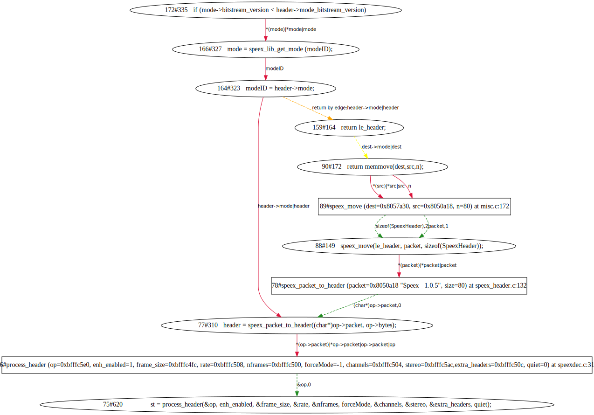

Output Examples
===================

CVE-2008-1686 speex null pointer dereference
--------------------------------------------

The following table shows the summary of `CVE-2008-1686 <http://www.cvedetails.com/vulnerability-list/vendor_id-7966/product_id-20855/year-2008/opec-1/Xiph-Speex.html>`_.

.. table:: Table 1 `CVE-2008-1686  summary <http://www.cvedetails.com/vulnerability-list/vendor_id-7966/product_id-20855/year-2008/opec-1/Xiph-Speex.html>`_

   +-------------+-------+---------------------+------------+-----------+-----+------+--------------------------+
   |CVE ID	 |CWE ID |Vulnerability Type(s)|Publish Date|Update Date|Score|Gained|Access Level		|
   +=============+=======+=====================+============+===========+=====+======+==========================+	
   |CVE-2008-1686|189	 |Exec Code	       |2008-04-08  |2011-05-19	|9.3  |Admin |Remote			|
   +-------------+-------+---------------------+------------+-----------+-----+------+--------------------------+
   |Array index vulnerability in Speex 1.1.12 and earlier, as used in libfishsound 0.9.0 and earlier, including |
   |Illiminable DirectShow Filters and Annodex Plugins for Firefox, xine-lib before 1.1.12, and many other      |
   |products, allows remote attackers to execute arbitrary code via a header structure containing a negative    |
   |offset, which is used to dereference a function pointer.                                                    |
   +------------------------------------------------------------------------------------------------------------+

First, construct a crash exploit. Then configure and use the robot_dbg.exp to record the source code execution trace.
Then let ClueHunter perform interprocedural analysis for a specific sink variable on it. It will output the interprocedural data dependency(.svg) file.

::

	.../cluehunter$python cluehunter.py -ps '*' -vs mode \
		-t test/gdb_logs/speex/CVE-2008-1686/speex-1.1.12/speexdec/gdb-speex-1.1.12_speexdec_mode.txt

Figure 1 shows the dependencies of variable ``mode`` which cause the crash.

   
   Figure 1  Data dependency graph of variable ``mode`` generated by cluehunter.py

Table 2 shows the meaning of the node and edge shape.
 
.. table:: Table 2 The Meaning of Shape for Node and Edge
   
   +-------------------------+----------------------------------------------------------------+
   |elipse node	             |statement							      |
   +=========================+================================================================+
   |square node	             |call info							      |
   +-------------------------+----------------------------------------------------------------+
   |solid red edge           |innner function data flow					      |
   +-------------------------+----------------------------------------------------------------+
   |dashed green edge        |connection of call info  and callsite			      |
   +-------------------------+----------------------------------------------------------------+
   |dashed yellow edge       |cross function data flow (mainly caused by argument definition) |
   +-------------------------+----------------------------------------------------------------+
   |dashed orange edge       |represent the data flow beteen the callsite's return statement  |
   |                         |and the call assignment                                         |
   +-------------------------+----------------------------------------------------------------+

The the crash is caused by the NULL pointer returned by ``speex_lib_get_mode(modeID)`` located at line 111 in the parsed trace snippets.
As ClueHunter parses the trace in a on-demand style, the recorded parsed snippets(trace.txt in the execution directory) may vary with each other.
ClueHunter provides the inner statement that cause this problem which is a if check that judges the ``modeID`` as an invalid value::

	719	  if (mode < 0 || mode > SPEEX_NB_MODES) return NULL;

To continue tracking the modeID, change the start line to the trace line(202) of the call site::

	327	   mode = speex_lib_get_mode (modeID);

Go into the cluhunter directory, type the following command then we got the answer.

::

	.../cluehunter$python cluehunter.py -ps 'N' -vs modeID -i 202 \
		-t test/gdb_logs/speex/CVE-2008-1686/speex-1.1.12/speexdec/gdb-speex-1.1.12_speexdec_mode.txt

(In this case we disabled the macro analysis as we does not specify `-m $BUILD_PATH_OF_SPEEX`.)

.. figure:: _static/images/speex-1.1.12_speexdec_modeID.svg
   :scale: 50 %
   :alt: speex-1.1.12 speexdec mode null pointer dereference
   :align: center
   
   Figure 2  Data dependency graph of variable ``modeID`` generated by cluehunter.py

For cluehunter the upper ogg page operation in trace line 73 is not an obvious assignment.
This is because cluehunter haven't included the ogg library tainting rules.
For a backup solution, we can still find the data flow by interleaving the manual effort and cluehunter.
Because we can control the start point to be analysed in the execution trace.

::

	main (argc=2, argv=0xbfffe884) at speexdec.c:583
	583	      data = ogg_sync_buffer(&oy, 200);
	585	      nb_read = fread(data, sizeof(char), 200, fin);
	586	      ogg_sync_wrote(&oy, nb_read);
	589	      while (ogg_sync_pageout(&oy, &og)==1)
	592	         if (stream_init == 0) {
	593	            ogg_stream_init(&os, ogg_page_serialno(&og));
	594	            stream_init = 1;
	597	         ogg_stream_pagein(&os, &og);
	598	         page_granule = ogg_page_granulepos(&og);
	599	         page_nb_packets = ogg_page_packets(&og);
	600	         if (page_granule>0 && frame_size)
	609	            skip_samples = 0;
	612	         last_granule = page_granule;
	614	         packet_no=0;
	615	         while (!eos && ogg_stream_packetout(&os, &op)==1)
	618	            if (packet_count==0)
	620	               st = process_header(&op, enh_enabled, &frame_size, &rate, &nframes, forceMode, &channels, &stereo, &extra_headers, quiet);

